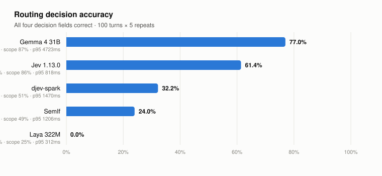
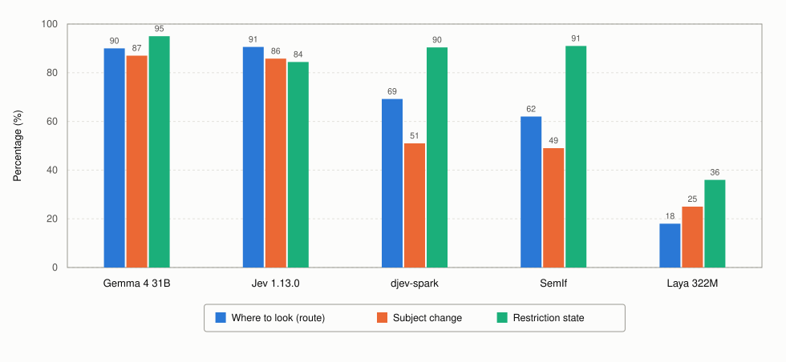

# Jev Benchmark

**English** · [繁體中文](README.zh-TW.md)

How well can five decision models run the routing step of a retrieval-augmented
assistant — across a whole conversation, not just one question?

<picture>
  <source media="(prefers-color-scheme: dark)" srcset="results/charts/leaderboard-dark.svg">
  
</picture>

## Why this exists

TypeSafe released Jev, a hosted model that answers a typed question with a typed answer
instead of prose — you hand it a situation and a list of options, and it hands back one
of the options with a probability on it. Within days there were open-source projects
doing the same thing: one reading option probabilities straight out of a frozen Qwen
model, one doing it with a diffusion model from Google, one shipping a 322M encoder
trained for the job.

That raises an obvious question for anyone about to build on this. The hosted one costs
money per call and sends your data somewhere else. The open ones run on your own
hardware. Are they actually interchangeable, and if not, where exactly does the
difference show up?

Nobody had measured that on a task with real structure, so we did.

## The setting

A company assistant answers questions out of its own material: six knowledge bases
covering policy, products, sales, projects and legal; eight specific documents such as a
signed contract and an 80-page manual; and six tools that read the ERP, the CRM, the
calendar, or open a support ticket.

This is retrieval-augmented generation, and the part being tested is the step *before*
the answer. Someone asks a question; something has to decide where the answer comes
from. Does it need a document opened, a knowledge base searched, a web lookup, a
database query — or is the answer already sitting in the conversation? Get that step
wrong and everything downstream is wrong too: the assistant answers from the wrong
source, or fetches nothing and makes something up.

In a single-question demo this is easy. Across a real conversation it is not, because
the ground keeps moving. The user says "actually, just use this document" and that
restriction has to hold for the next several turns. Two turns later they change the
subject entirely, and the old restriction should go. Then they say "also check the
current discount policy" — is that a new topic, or the same one with one more source?

The benchmark is a hundred of those moments: twenty conversations, five turns each.
Every turn arrives with the history that preceded it, so all five systems face exactly
the same situation. Nothing is actually retrieved and no tool really runs — what is
being graded is the decision, not the answer.

## What each number means

Every turn, a system has to get four things right at once.

**Where to look** (`route`) — one of nine answers: use what is already in the
conversation, answer from general knowledge, open a named document, search a knowledge
base, look it up on the public web, call a tool, combine two of those, ask the user for
something missing, or refuse because it is not allowed.

**Did the subject change** (`scope change`) — this is the one that makes multi-turn hard.
Six answers: nothing moved, the user switched topics, the same task now needs one more
source, the user narrowed things down, the sources in play conflict so the assistant
should ask before acting, or the request is blocked. Getting this wrong is how an
assistant ends up searching the whole knowledge base when the user said "only this file".

**How to handle it** (`mode`) — answer the question, rewrite or summarise something,
analyse and compare, ask for clarification, or block.

**What restriction holds afterwards** (`restriction`) — whether the next turn may pick
sources freely, is confined to specific documents, or may not touch the public web. This
one persists: it carries from turn to turn until the user lifts it, so an error here
quietly corrupts every turn that follows.

**Decision correct** in the tables below means all four were right on the same turn.

## Results

| System | Decision correct | Where to look | Subject change | How to handle | Restriction | p50 | p95 |
|---|---|---|---|---|---|---|---|
| **Gemma 4 31B** (self-hosted) | **77.0%** | 90.0% | 87.0% | 92.0% | **95.0%** | 2,293 ms | 4,723 ms |
| **Jev 1.13.0** (hosted API) | 61.4% | **90.6%** | 85.8% | 91.6% | 84.4% | **749 ms** | **818 ms** |
| djev-spark (self-hosted) | 32.2% | 69.2% | 51.0% | 80.2% | 90.4% | 1,230 ms | 1,470 ms |
| SemIf (self-hosted) | 24.0% | 62.0% | 49.0% | 65.0% | 91.0% | 627 ms | 1,206 ms |
| Laya 322M (self-hosted) | 0.0% | 18.0% | 25.0% | 10.0% | 36.0% | **189 ms** | 312 ms |

p50 is the typical response time and p95 is the slow tail — nineteen out of twenty
responses come back faster than that.

<picture>
  <source media="(prefers-color-scheme: dark)" srcset="results/charts/decisions-dark.svg">
  
</picture>

Three of the four decisions, on one scale. "How to handle it" is left out because the
top two systems sit within half a point of each other there and it separates nothing.
What the chart makes plain is that Gemma and Jev are level on the first two bars and
part company on the third.

Full tables, including the benchmark's own stricter score, are in
[`results/summary.md`](results/summary.md).

## What the numbers say

**Gemma and Jev are close on the decision and far apart on memory.** Their choice of
where to look is within half a point of each other, and their subject-change calls within
about one point. Almost the entire gap is the restriction state: 95% against 84%. Because
that field carries forward, an error there poisons the rest of the conversation — which
is why Gemma gets roughly twice as many whole conversations right.

**Jev is the predictable one.** Its slow tail is barely slower than its typical response,
818 ms against 749 ms. Gemma's slow tail is more than double its typical and runs past
four seconds. If you are promising a response time rather than reporting an average, that
matters more than the accuracy gap does.

**Nobody knows when to stop and ask.** When a request genuinely lacks something the
assistant needs, the right move is to ask for it. Gemma does that 43% of the time and Jev
31%, and both fail the same way: instead of asking, they call a tool. If the tool has
side effects — filing a ticket, sending a message — the routing model cannot be the only
thing standing in front of it.

**Two of the five should not be deployed for this.** Laya is the fastest by a wide margin
and gets nothing right; its own documentation says the base model is near chance on this
kind of task without fine-tuning. SemIf never once recognised a request that should be
refused on permission grounds — fifteen opportunities, zero catches.

## What had to be fixed before the numbers meant anything

Five measurement faults produced badly wrong conclusions along the way, and most were
invisible in the scores themselves. The worst left one system scoring 3.8% when its real
result was 32.2%: our adapter was sending Chinese text in an escaped form that made the
input five times longer, and the number of questions happened to cross a threshold that
put the server into a broken answer format. Another silently turned whole runs into
zeroes, because an SSH tunnel dropped and a connection failure scores exactly like a
wrong answer.

The full account is in [`docs/method.md`](docs/method.md). The short version: when a
system scores badly, confirm it is actually reading the input before believing the
number.

## What is in here

| Path | Contents |
|---|---|
| [`questions/`](questions/) | The eleven questions each system is asked, and why they are split that way |
| [`results/summary.md`](results/summary.md) | Full result tables |
| [`results/per_system/`](results/per_system/) | Every prediction, timing record and score, per system per repeat |
| [`results/charts/`](results/charts/) | The charts above |
| [`docs/method.md`](docs/method.md) | How the runs were done and what can go wrong |
| [`docs/gold-audit.md`](docs/gold-audit.md) | Audit of the answer key, done before any system was run |
| [`code/`](code/) | Adapters and scoring scripts |

## Limits worth knowing

This is a scripted replay, not a live agent. Nothing branches when a system takes a wrong
turn, so a high score here does not mean a system completes real tasks. The answer key is
synthetic and has not been independently reviewed; our audit found one genuinely arguable
label and one rule the answer key follows but never states. Each conversation is only
five turns, far short of where memory usually starts to fail. Self-hosted timings share a
GPU with other work and are therefore conservative.
