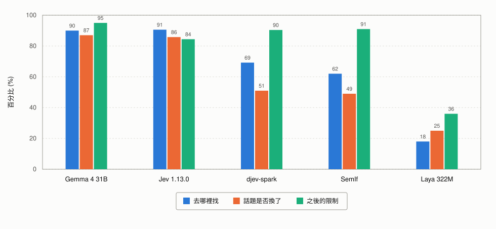

# Jev 評測結果

[English](README.md) · **繁體中文**

<picture>
  <source media="(prefers-color-scheme: dark)" srcset="results/charts/leaderboard-dark.svg">
  
</picture>

TypeSafe 推出了 Jev。它和一般會生成文字的模型不太一樣，你給它一個情境和一組選項，它不會寫一大段回答，而是直接選出其中一個選項，並附上一個機率。

Jev 推出後，社群很快也出現不少類似的開源方案。所以我們想做一個實際評測，看看這些開源方案和 Jev 放在同一個真實的 Agent 路由場景裡，差距到底有多大。

## 評測場景

我們模擬了一個企業內部的 RAG Agent。

它可以存取六個知識庫，內容涵蓋公司制度、產品、銷售、專案與法務；也可以直接讀取八份指定文件，例如已簽署的合約，或一份八十頁的操作手冊；另外還有六個工具，可以查 ERP、CRM、行事曆，或建立工單。

這份測試不評「最後回答得好不好」，而是評回答之前最重要的那一步：

**這個問題到底該去哪裡找答案？**

使用者問了一個問題之後，系統可能需要打開某份文件、搜尋知識庫、上網查資料、查資料庫，或呼叫某個工具。也有可能根本不用查，因為答案已經出現在前面的對話裡。

如果這一步判斷錯了，後面的回答通常也會跟著錯。Agent 可能跑去錯的資料來源找答案，也可能什麼都沒查就直接自己回答。

單看一個問題時，這件事其實不難。

真正困難的是多輪對話。

例如使用者一開始問公司制度，下一輪突然說「算了，只看這份文件」。又或者聊了兩輪之後直接換話題。也可能在原本的問題上補一句「順便幫我查一下現在的折扣」。

這時候系統不只要理解問題，還要判斷：

這是一個全新的話題，還是原本問題多了一個資料來源？

這正是這類決策模型很適合處理的地方。

這份 benchmark 一共有 100 題，由 20 段對話組成，每段對話有 5 輪。每一輪都會附上前面完整的對話內容。

測試過程不會真的去讀文件，也不會真的呼叫工具。我們只評估模型做出的**決策是否正確**，不評估資料取回後產生的答案。

每一輪，系統都要同時判斷四件事。

### 答案要去哪裡找（`route`）

系統要從九種路徑中選一種：

使用對話裡已經有的內容、直接用一般常識回答、讀取指定文件、搜尋知識庫、搜尋公開網路、呼叫工具、同時使用兩種來源、向使用者追問缺少的資訊，或因為權限或規則限制而拒絕執行。

### 話題有沒有改變（`scope change`）

多輪對話真正困難的地方主要就在這裡。

系統要從六種情況中選一種：

話題沒有改變、使用者換了話題、同一件事新增了一個資料來源、使用者縮小了範圍、不同來源之間有衝突所以應該先追問，或這個請求應該被擋下。

例如使用者明明已經說「只看這個檔案」，系統卻還跑去搜尋整個知識庫，就是典型的 scope 判斷錯誤。

### 要怎麼處理（`mode`）

系統還要判斷這一輪應該：

直接回答、改寫或摘要、分析比較、向使用者追問，或拒絕執行。

### 接下來受什麼限制（`restriction`）

最後，系統還要判斷下一輪之後能使用哪些資料來源。

例如可以自由選擇來源、只能使用使用者指定的幾份文件，或不允許搜尋公開網路。

這個狀態會一路延續到後面的對話，直到使用者明確解除限制。

因此這一項如果判斷錯，不只會影響當前這一輪，還可能一路影響後面幾輪。

下面表格裡的**決策正確**，代表同一輪裡這四個判斷必須全部正確才算答對。

## 結果

| 系統                     | 決策正確      | 去哪裡找      | 話題是否換了 | 怎麼處理  | 之後的限制     | p50        | p95        |
| ---------------------- | --------- | --------- | ------ | ----- | --------- | ---------- | ---------- |
| **Gemma 4 31B**（自建）    | **77.0%** | 90.0%     | 87.0%  | 92.0% | **95.0%** | 2,293 ms   | 4,723 ms   |
| **Jev 1.13.0**（託管 API） | 61.4%     | **90.6%** | 85.8%  | 91.6% | 84.4%     | **749 ms** | **818 ms** |
| djev-spark（自建）         | 32.2%     | 69.2%     | 51.0%  | 80.2% | 90.4%     | 1,230 ms   | 1,470 ms   |
| SemIf（自建）              | 24.0%     | 62.0%     | 49.0%  | 65.0% | 91.0%     | 627 ms     | 1,206 ms   |
| Laya 322M（自建）          | 0.0%      | 18.0%     | 25.0%  | 10.0% | 36.0%     | **189 ms** | 312 ms     |

p50 可以理解成一般情況下的回應時間。

p95 則代表比較慢的情況。簡單來說，二十次請求裡，大約有十九次會比這個數字快。

<picture>
  <source media="(prefers-color-scheme: dark)" srcset="results/charts/decisions-zh-dark.svg">
  
</picture>

上圖把四個決策中的三個放在同一個尺度上比較。

「要怎麼處理」沒有放進圖裡，因為 Gemma 和 Jev 在這一項只差不到半個百分點，幾乎沒有差異。

真正值得注意的是前兩項和第三項。

Gemma 和 Jev 在「去哪裡找」以及「話題是否改變」這兩項非常接近，真正把整體分數拉開的是第三項，也就是限制狀態的更新。

完整結果，包括這份 benchmark 使用的更嚴格計分方式，可以參考 [`results/summary.md`](results/summary.md)。

## 這些數字代表什麼

### Gemma 和 Jev 的路由能力其實很接近，真正的差距在狀態更新

如果只看最核心的路由判斷，Gemma 和 Jev 幾乎打平。

「去哪裡找」只差不到半個百分點，「話題是否改變」也只差大約一個百分點。

整體正確率會從 77% 拉開到 61.4%，主要原因其實是 `restriction`。

Gemma 在這一項有 95% 的正確率，Jev 則是 84.4%。

這裡要特別說明，這並不是模型「記不住前面的對話」。

每個系統拿到的都是完整對話內容。

到了第五輪時，輸入裡已經包含前面所有問題、工具結果和回答，一共有十一筆訊息。當下有效的限制也會直接寫在輸入裡。

所以模型不需要自己記住上一輪發生了什麼。

它真正需要做的是：

**看著目前已知的限制，判斷這一輪結束之後，限制應該變成什麼。**

Jev 在這件事情上的準確率比較低。

而且 `restriction` 不是只影響當前這一輪，它的結果會繼續傳到下一輪。

因此只要前面更新錯一次，後面的對話就可能一路受到影響。

這也是為什麼 Gemma 能完整答對的整段對話數，大約是 Jev 的兩倍。

既然狀態本身已經直接提供給模型，這個問題也不是單純增加更多 Context 就能解決。

### Jev 的延遲明顯更穩定

Jev 最大的優勢是延遲非常穩定。

它的 p50 是 749 ms，p95 是 818 ms。

也就是一般請求和比較慢的請求之間，只差大約 70 ms。

Gemma 的 p50 是 2.3 秒左右，但 p95 已經超過 4.7 秒。

所以如果實際產品在意的不只是平均速度，而是希望每一次決策時間都可以預測，那 Jev 的延遲表現會非常有吸引力。

### 大家都不太會判斷「什麼時候應該先問使用者」

另一個很明顯的弱點，是所有系統都不太擅長判斷什麼時候應該先追問。

有些請求缺少必要資訊，正確做法其實不是立刻查資料或呼叫工具，而是先問使用者。

在這類題目上，Gemma 的正確率只有 43%，Jev 更只有 31%。

而且兩者最常出現的錯誤都一樣：

**沒有先問，直接呼叫工具。**

如果這個工具只是查詢資料，問題可能還不大。

但如果工具本身會產生副作用，例如建立工單、寄出訊息、修改資料，那就不能只靠路由模型作為唯一的安全檢查。

工具執行前仍然需要額外的驗證或權限控制。

### 有些模型目前不適合直接拿來做這種路由

Laya 的速度非常快，p50 只有 189 ms。

但在這份 benchmark 裡，完整決策正確率是 0%。

它自己的文件其實也有提到，基礎模型如果沒有針對這類任務微調，表現會接近隨機猜測。

SemIf 的問題則比較集中在權限與拒絕判斷。

測試中一共有十五次應該因為權限或規則而拒絕的情境，SemIf 一次都沒有正確辨識出來。

所以這兩個方案目前即使速度快，也還不適合直接拿來當企業 Agent 的主要路由層。

## 相關參考檔案

| 路徑                                           | 內容                               |
| -------------------------------------------- | -------------------------------- |
| [`questions/`](questions/)                   | 每個系統被問的十一道題，以及為什麼這樣拆             |
| [`results/summary.md`](results/summary.md)   | 完整結果表                            |
| [`results/per_system/`](results/per_system/) | 每個系統每一輪的預測、計時與評分                 |
| [`results/charts/`](results/charts/)         | 上面的圖表                            |
| [`docs/method.md`](docs/method.md)           | 測試方法，以及執行時可能遇到的問題                |
| [`docs/gold-audit.md`](docs/gold-audit.md)   | Golden Answer 的稽核結果，在跑任何系統之前就已完成 |
| [`code/`](code/)                             | 各系統的轉接程式與計分程式                    |
